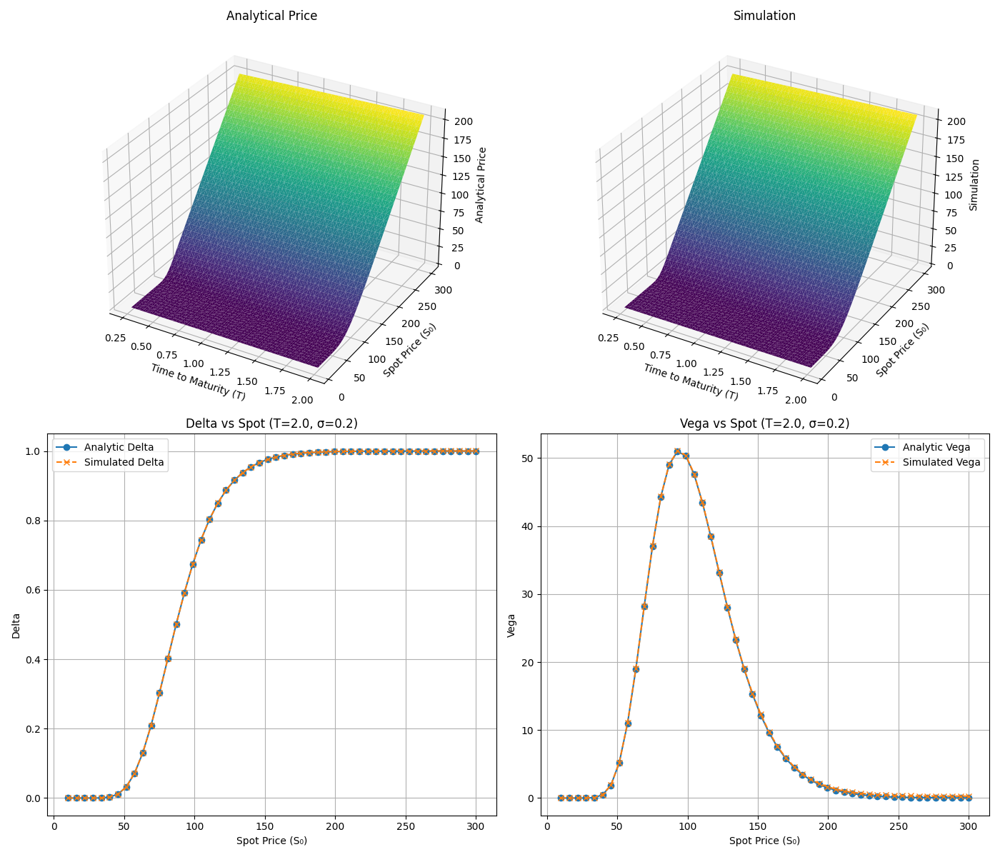
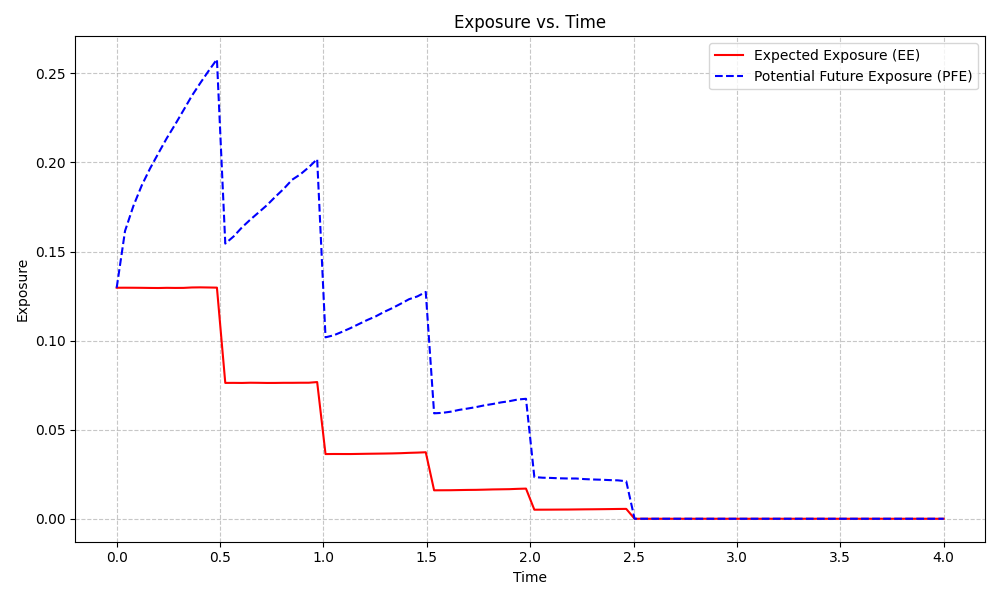
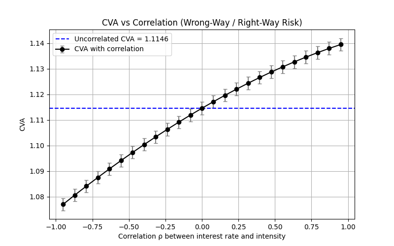
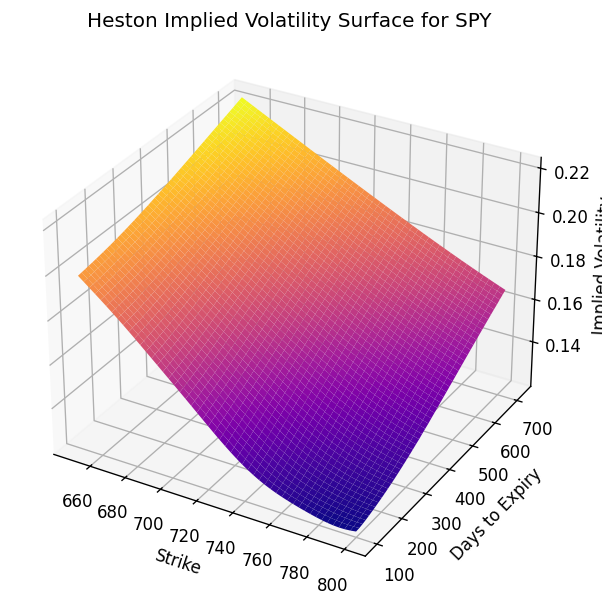
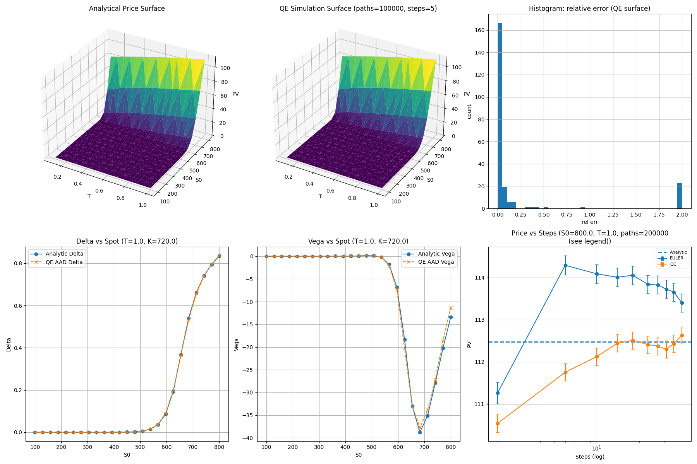

# Monte Carlo Simulation Engine

> A flexible, extensible Monte Carlo simulation engine for pricing and risk analytics of financial derivatives.  
> Copyright (c) 2025 Dr. Konstantin K. C. Eder

---

## Overview

This project provides a modular, high-performance Monte Carlo framework for **derivative pricing**, **exposure calculation**, and **xVA risk analytics**, built on top of **PyTorch** for CPU acceleration and adjoint algorithmic differentiation (AAD).

The engine supports equity, interest-rate, credit, and hybrid models, along with a wide range of financial products and risk metrics.

---

## Key Features

### Risk Metrics

- **PV** – Present Value  
- **CE** – Current Exposure  
- **EE / EPE** – (Effective) Expected Exposure  
- **ENE** – Expected Negative Exposure  
- **EEPE** – Effective Expected Positive Exposure  
- **PFE** – Potential Future Exposure  
- **xVA** – currently **CVA**, with extension points for DVA / FVA / MVA / KVA  

All metrics are computed via Monte Carlo and return **both the estimate and its Monte Carlo standard error**.

### Sensitivities & AAD

- Efficient, scalable **adjoint algorithmic differentiation (AAD)** via [PyTorch](https://pytorch.org/)  
- Payoff smoothing using fuzzy-logic techniques to enable AAD for discontinuous payoffs
  (binary options, barrier options, early-exercise structures)
- CPU-ready design for large-scale simulations

### Supported Products

- European equity & bond options  
- Bermudan equity & bond options  
- Bermudan swaptions  
- American options  
- FlexiCalls  
- Binary options  
- Barrier options  
- Basket / multi-asset options  
- Interest rate swaps  
- Bonds: zero-coupon bonds, coupon bonds, floating-rate notes (FRNs)

### Stochastic Models

- **Equity**
  - Black–Scholes (single-asset)
  - Black–Scholes multi-asset
  - Heston Model
- **Interest Rates**
  - Vasicek
  - Hull–White
- **Credit**
  - Shifted Cox–Ingersoll–Ross (**CIR++**) with bootstrapped hazard curves from CDS spreads
- **Hybrid ModelConfig**
  - Configure multiple models jointly with a correlation structure to simulate hybrid risk factors  
    (e.g. Vasicek interest rates + CIR++ default intensities with wrong-way risk).

---

## Architecture

- **SimulationController**  
  Orchestrates Monte Carlo simulations, time stepping, and path generation.

- **ModelConfig**  
  Combines one or more stochastic models and an inter-asset correlation matrix.

- **Metrics API**  
  Pluggable interface for defining numerical and analytical metrics (PV, EE, PFE, CVA, …).

- **Exposure & Regression Engine**  
  Supports Longstaff–Schwartz regression for continuation values and exposure estimation.

- **Request/Response Interface**  
  Models expose quantities (discount factors, survival probabilities, forward rates, etc.) via
  a lightweight request abstraction, allowing flexible model coupling.

The design makes it easy to:

- add new models  
- add new products  
- define new metrics  
- extend to further xVA measures

---

## Example Results

### PV and Sensitivities for a European Option

Present value and corresponding sensitivities for various spots and maturities:



---

### Exposure Profiles

Expected and potential future exposure for a bermudan swaption:



---

### CVA vs Correlation – Payer Interest Rate Swap (WWR)

CVA of a payer interest rate swap as a function of the correlation ρ between the short rate (Vasicek)
and the default intensity (CIR++). Positive correlation between rates and intensity induces **wrong-way risk**, so CVA
**increases** with ρ. Negative correlation generates **right-way risk**. Error bars show Monte Carlo
standard errors.



---

### Heston Model – Calibration, Pricing, and Sensitivities

The Heston stochastic volatility model is calibrated to equity option data and used for pricing, risk, and convergence analysis.
- Calibration recovers realistic skew and term structure, producing a smooth implied volatility surface



- Pricing uses the Quadratic–Exponential (QE) scheme of Andersen (2007)
- Fuzzy-logic smoothing is applied at the QE branching threshold to ensure numerical stability and full compatibility with pathwise AAD
- Greeks (Delta, Vega) computed via AAD are validated against analytic finite differences
- Convergence of Euler vs QE is analyzed with Monte Carlo error bars



The QE scheme with fuzzy branching delivers accurate prices, stable sensitivities, and significantly faster convergence than Euler discretization, while remaining fully differentiable.


## Notebooks

Interactive **Jupyter Notebooks** are provided to demonstrate and explain key components of the Monte Carlo Engine.  
These notebooks serve both as **tutorials** and as **technical deep dives**, and are currently under development.

### Available Notebooks

#### **1. American & Bermudan Option Valuation**
- Illustration of regression-based continuation value estimation (Longstaff–Schwartz)
- Early-exercise regions visualized
- Comparison of:
  - Standard Monte Carlo
  - Least-Squares Monte Carlo (LSM)
  - Machine-learning–based approaches (e.g. Reinforcement Learning)
- Sensitivity analysis with adjoint differentiation

#### **2. Credit Derivatives & Basket CDS Pricing**
- Bootstrapping hazard rates from market CDS spreads
- Pricing of:
  - Single-name CDS
  - First-to-default and k-th-to-default basket CDS
- Copula-based dependency modeling:
  - Gaussian copula
  - t-copula
- Monte Carlo estimation of portfolio loss distribution
- CVA-style exposure profiles for credit instruments

### Additional Notebooks (Planned)
- Libor Market Model (LMM) simulation examples  
- Wrong-way risk analysis for swaps and structured credit  
- Exposure, EE/EPE/PFE profiles for various asset classes  
- Full xVA stack demonstration (CVA/DVA/FVA/MVA/KVA)

---

## Roadmap

- [x] Add credit derivatives (e.g. CDS, basket CDS)  
- [x] Add `ModelConfig` to configure and simulate several models simultaneously  
- [ ] Extend the request interface to support composite requests  
- [ ] Add **Libor Market Model (LMM)**  
- [ ] Add **Merton** jump-diffusion model  
- [ ] Introduce netting sets and collateralization (CSA, margining)  
- [ ] Extend xVA stack (DVA, FVA, MVA, KVA)

---

## Installation & Quick Start

You can run **montecarlo-risk-engine** either:

- directly on your machine using Python, or  
- inside a **Docker container** (recommended for zero-configuration setup)

---

### 🔧 Option 1 — Local Installation (Python)

```bash
git clone https://github.com/konstantineder/montecarlo-risk-engine.git
cd montecarlo-risk-engine
python3.12 -m venv .venv
source .venv/bin/activate          # macOS/Linux
# or:
.\.venv\Scripts\activate           # Windows

pip install -r requirements.txt
```

### 🔧 Option 2 — Run with Docker (works out of the box)

```bash
docker build -t mcengine .
docker run -it mcengine python tests/pv_tests/pv_european_option.py
```